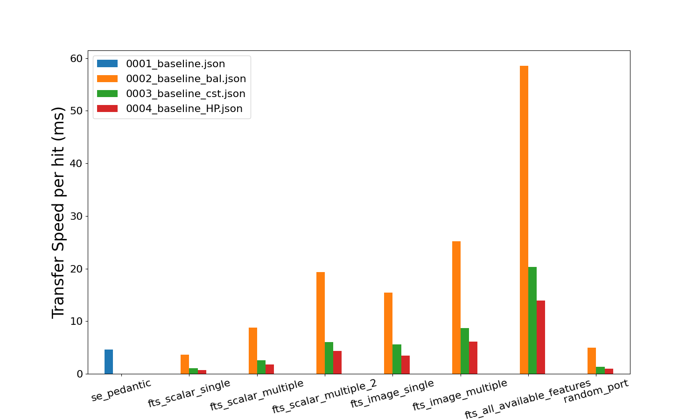

.. _sec_developers:

==========================
Information for Developers
==========================

Plug-ins
--------
You may need to install extra dependencies for some plug-ins,
such as the autofocus plugin.

::

    pip install -r tests/requirements.txt

To write plug-ins, see the :ref:`Writing Plug-ins <sec_writing_plugins>` section.
To run plugins, see the :ref:`Command-line interface <sec_cli>` section.

Testing
-------
Running tests

::

    pytest tests

If you don't wish to run the benchmarking tests (which can take some time) use

::

    pytest tests --ignore=tests/benchmarking_tests

.. _sec_benchmark_tests_local:

Benchmark Testing
-----------------

For more information on benchmarking, see
`pytest-benchmark.readthedocs.io <https://pytest-benchmark.readthedocs.io/en/stable/>`__.
One can run the benchmarking tests locally with

::

    pip install -r tests/benchmarking_tests/requirements.txt
    pytest tests/benchmarking_tests

To create a local benchmark file (with which you can compare further tests),
use

::

    pytest tests/benchmarking_tests --benchmark-save="NAME"

where "NAME" should be similar to "user_date_otherinfo" for tracking purposes,
e.g., "eoghan_190321_WINpy38.json". Note that a counter is appended as a prefix
in the saved file, e.g., "0001_eoghan_190321_WINpy38.json"

Then, when you need to make sure new changes aren't regressing Shape-Link, use

::

    pytest tests/benchmarking_tests --benchmark-compare="*/0001_eoghan_21-03-19_WINpy38" --benchmark-compare-fail=median:5%

.. _sec_feature_transfer_plot:

Feature transfer speeds
.......................

You can output plots that compare benchmark tests.
They show how long each feature transfer takes in milliseconds.
This is helpful for understanding how fast each feature can be transferred
during acquisition.

.. note::
    These transfer values include the initial time taken for the
    server and client to connect. Therefore, the plots overestimate
    the transfer values. To get a more accurate transfer value,
    use :ref:`line_profiler (kernprof) <sec_line_profiler>`.

::

    python tests\benchmarking_tests\benchmark_utils.py

These plots will be saved locally in the same directory.

.. _sec_benchmark_tests_remote:

Adding a new Benchmark for Github Actions
-----------------------------------------

Shape-Link uses continuous integration with GitHub Actions. The benchmarking
tests are run under the `"Benchmark with pytest-benchmark"
<https://github.com/ZELLMECHANIK-DRESDEN/shapelink/blob/main/.github/workflows/check.yml>`__
step. Any push or pull requests will trigger this step. To add a new benchmark file for GitHub
Actions, follow the steps below:

.. Note::
   GitHub Actions currently builds a matrix of OS and Python versions.
   Therefore, minor warnings will appear stating that the OS or Python versions
   don't match the current benchmark comparison files. You can ignore this
   warning. We recommend using the output from the Ubuntu-py3.8 build to create
   the new benchmark file.

1. Push your changes. Then go to the GitHub Actions build tab on GitHub. If the
   benchmarking tests passed, open the "Benchmark with pytest-benchmark"
   output.
2. Under the "===== passed =====" log, copy the contents of the `output.json`
   file. Do not copy the ZMQ errors.
   Paste in a new `.json` file in your local repo in the
   `./.benchmarks/actions_benchmarks` folder. This file should be named
   similar to: `ActionsBenchmark_21-03-19_UBUNTUpy38.json`, where the date should
   change (yy-mm-dd).
3. Open the `./.github/workflows/checks.yml` file and replace the name of the
   --benchmark-compare="actions_benchmarks/ActionsBenchmark_190321_ubuntu_py38"
   to the name of your file.
4. Commit and push your changes. Now the github actions workflow will compare
   its live benchmark run to the new file you just created.

.. _sec_line_profiler:

Using line_profiler (kernprof)
------------------------------

The above benchmarking tests are good but not perfect estimations of
feature transfer speed. They have a flaw: the initial time taken
to connect the server and client is included in the transfer speed
value. This initial time is sometimes a substantial (~33%) part of the
overall time.

line_profiler, formally kernprof, is a package that tests the speed
of excecution of each line of code in your program. You just need to
install line_profiler and decorate the relevant functions with the
``@profile`` decorator.

Installing line_profiler
........................

See installation details on the
`official pyutils repository <https://github.com/pyutils/line_profiler#installation>`_.
First try to install with pip::

    pip install line_profiler

If you are using windows and ``pip install line_profiler`` does not work,
use one of these
`pre-built wheels <https://www.lfd.uci.edu/~gohlke/pythonlibs/#line_profiler>`_.
Once you have downloaded the correct wheel for your computer architecture,
you can install the wheel with pip::

    pip install path\to\the\wheel

Using line_profiler
...................
The official pyutils repository has a
`short guide <https://github.com/pyutils/line_profiler#line_profiler>`_.
Place ``@profile`` above the function you wish to profile.
Then, run the following in terminal::

    kernprof -l -v path/to/file.py
